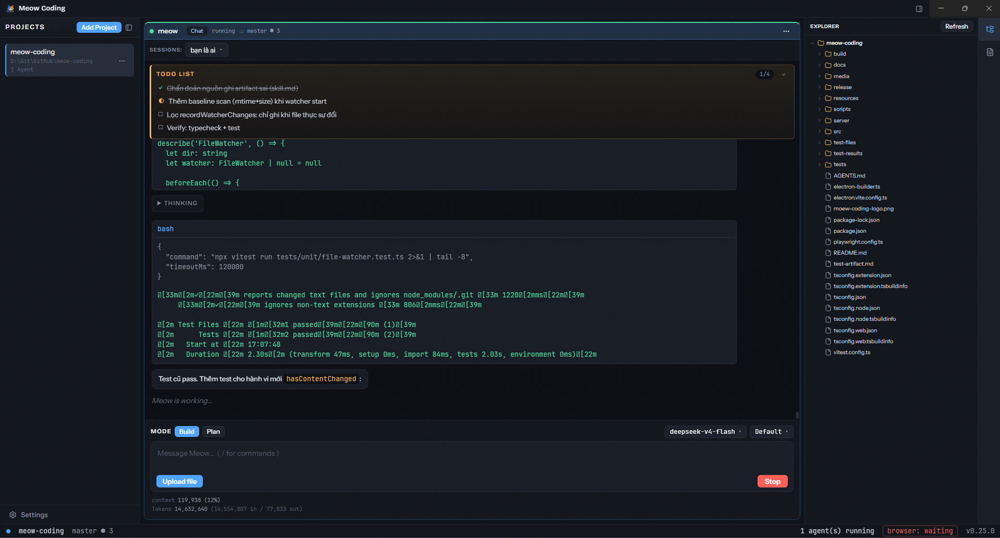

# BS Coding

**BS Coding** is a desktop app for running multiple CLI coding agents side by side — opencode,
Claude Code, aider, and any other CLI agent you put on `PATH` — in parallel terminal panes inside a
single window. It also ships a built-in **native "BS" agent** with its own chat UI, tool registry,
sessions, permissions, and skill system.

<p align="center">
  
</p>

## Highlights

- **Multi-agent panes** — spawn several CLI coding agents in one window, each in its own terminal
  pane. Stop / restart / inject / zoom per pane; process trees are killed on exit (no orphans).
- **Native BS agent** — a first-party coding agent with chat UI, streaming output, markdown
  rendering, tool-call cards, image attachments, and undo/redo.
- **Slash commands** — `/init`, `/review`, `/new`, `/frontend-design`, and Superpowers workflows
  (`/sp-*`), plus custom commands with `$1..$N`, `$ARGUMENTS`, `@path` references and `!`cmd``
  shell interpolation.
- **Bundled skills** — 19 skills loadable by the agent: 14 Superpowers workflow skills and 5
  Anthropic front-end/design skills (`frontend-design`, `canvas-design`, `theme-factory`,
  `brand-guidelines`, `web-artifacts-builder`).
- **Sessions** — create / switch / rename / delete conversations per agent, with auto-title and
  per-session undo/redo through file snapshots.
- **MCP & LSP** — stdio and HTTP MCP servers, plus language-server diagnostics surfaced in the
  agent's edit tools.
- **Cost tracking** — token and dollar usage per session and per model via the models.dev catalog.
- **Office documents** — the native agent can create and edit `.docx`, `.xlsx`, and `.pptx` through
  the `office` tool (powered by OfficeCLI; binary auto-downloaded on first use).
- **Model Connections** — manage Claude Code / Codex / API-key accounts with OAuth login, account
  switching, and quota monitoring (see below).
- **Project explorer & artifacts** — right panel with a lazy-loaded directory tree (expanded state
  survives tab switches) and an artifacts list of the `.md` files agents created or edited.
- **Browser bridge** — control a real Chrome profile through a local WebSocket bridge paired with a
  Chrome extension (MV3), with browser/click/type tools for the native agent.

## What it's based on (Sources)

BS Coding is built on open-source technology and openly credits its design influences:

- **opencode** — the native agent's feature set (slash commands, undo/redo, LSP diagnostics,
  compaction, cost tracking, MCP, skills) is modeled on opencode's architecture. See
  `docs/superpowers/notes/2026-08-05-opencode-feature-diff.md` for the detailed feature comparison.
- **[obra/superpowers](https://github.com/obra/superpowers)** — the Superpowers workflow skills
  (brainstorming, writing-plans, executing-plans, systematic-debugging, etc.) bundled under
  `resources/skills/`.
- **[anthropics/skills](https://github.com/anthropics/skills)** (Apache-2.0) — the front-end and
  design skills (frontend-design, canvas-design, theme-factory, brand-guidelines,
  web-artifacts-builder), bundled verbatim with their original `LICENSE.txt`.
- **[iOfficeAI/OfficeCLI](https://github.com/iOfficeAI/OfficeCLI)** (Apache-2.0) — the `office` tool
  for creating and editing Office documents.
- **[@lydell/node-pty](https://github.com/microsoft/node-pty)** and **[xterm.js](https://xtermjs.org/)**
  — PTY and terminal rendering.
- **Electron, electron-vite, React, TypeScript** — the application shell and UI.

## Features

### Workspaces & panes

- Add git project folders as workspaces (persisted in `userData/workspaces.json`).
- Launch agents from templates — defaults for **bs** (native), **opencode**, **claude code**,
  and **aider**; add your own custom launch templates.
- Per-pane status badge shows agent state, git branch, and dirty-file count.
- Zoom a pane to full window; agents can run in the background.

### Native agent

- Full tool registry: `bash`, `edit`, `write`, `read`, `apply-patch`, `glob`, `grep`, `git`,
  `question`, `todowrite`, `task` (subagents), `revert`, `skill`, `webfetch`, `websearch`, `lsp`,
  `browser` (drive a real Chrome profile), and `office`.
- Permission rules per tool: `allow` / `ask` / `deny`, with "always allow" persistence.
- Context compaction with auto-continue, prune, and tool-output truncation to stay within budget.
- User tools loaded from `userData/tools`, and project `.bs/` directories for project-level
  commands, skills, and AGENTS.md instructions.
- System prompt assembles AGENTS.md instructions, available skills, and workspace context.

### Providers & models

- Anthropic and OpenAI-compatible providers.
- Model catalog from models.dev with provider/model browsing and per-agent model selection.
- Model variants (effort levels) and a "plan" vs "build" agent mode.

### Model Connections (account management)

- **Claude Code**: OAuth login (PKCE), multiple accounts, one-click switch, quota/plan view. Each
  account gets its own `CLAUDE_CONFIG_DIR` so your real `~/.claude` is never touched.
- **Codex**: OAuth login via local callback, switches by writing `~/.codex/auth.json` (atomic,
  with backup/restore), quota view.
- **API key vault**: provider API keys stored encrypted in the OS keychain (safeStorage) instead of
  plaintext in settings; `keyRef` resolves at runtime.
- Quota monitoring with `[bs]` alerts when usage crosses 90% (5-minute cooldown).

### UI & desktop

- Frameless custom title bar (min / max / close) with lucide-react icons.
- "Studio Dark" design system: tokenized fonts, colors, and a coral accent.
- Settings dialog covering connections, providers, agents, permissions, MCP, context, commands,
  templates, and remote control.
- Idle/exit alert notifications; per-agent logs written to `userData/logs/<agentId>.log`.

### Right panel (explorer & artifacts)

- **Directory tree** — lazy-loads folders on first expand, auto-expands the project root, and
  refreshes in the background when the project changes. Expanded folders and scroll position
  survive switching between the Tree and Artifacts tabs.
- **Artifacts** — lists only the `.md` files agents created or edited (via write/edit/apply-patch
  tools, or file-watcher attribution for external CLI agents). Spurious watcher events — reads,
  AV scans, indexer touches — are filtered out by comparing `(mtime, size)` against a baseline, so
  files an agent merely read never appear.
- Resizable panel with a fixed header; both tabs stay mounted for instant switching.

### Remote control (mobile) — coming soon

The desktop side is ready: enable **Settings → Remote Control**, point it at a self-hosted
WebSocket relay (`server/`), and pair with a 6-digit code (TTL ~5 min). The mobile app that
consumes this protocol is **coming soon** — see `docs/remote-control.md` for the protocol and
relay setup.

## Architecture

Electron runs three isolated processes communicating over a centralized IPC contract, plus two
companion pieces:

- **`src/main`** — Electron main process: PTY management, stores, services, IPC handlers, and app
  lifecycle. The only place that spawns/kills processes. Also hosts the Chrome browser bridge
  (`src/main/browser`) and the file watcher that attributes external agent edits to artifacts.
- **`src/preload`** — context bridge exposing a typed `window.api` (implements `AgentApi`).
- **`src/renderer`** — React UI: sidebar, pane grid, terminal, native-agent chat panel, and the
  right-panel explorer/artifacts.
- **`src/shared`** — shared types and the IPC contract (`Channels` + `AgentApi`); no Node/Electron
  imports here.
- **`src/browser-extension`** — Chrome MV3 extension (built separately with esbuild) that pairs
  with the desktop browser bridge.
- **`server/`** — optional self-hosted WebSocket relay for the remote-control (mobile) protocol.

(The browser-extension and server are not Electron processes; they connect to the desktop over
WebSocket.)

Security: `contextIsolation: true`, `nodeIntegration: false`; the renderer never touches Node or
Electron directly.

For the technical reference — how each domain works, the types involved, and the reasoning behind
the decisions — see [`docs/design/`](docs/design/README.md).

## Requirements

- Node.js 20+
- Git
- The CLI agents you want to run available on `PATH` (e.g. `opencode`, `claude`, `aider`)

## Development

```bash
npm install
npx @electron/rebuild -f -w @lydell/node-pty   # Windows: rebuild native binding if missing
npm run dev                                    # start electron-vite dev
```

Other commands:

```bash
npm run build       # build
npm run start       # preview build
npm run dist        # package Windows installer (NSIS + portable)
npm run dist:linux  # package Linux (AppImage + deb)
npm run dist:mac    # package macOS (dmg + zip; must run on macOS)

### CI / Releases

GitHub Actions (`.github/workflows/build.yml`) builds Windows, macOS, and Linux installers on each
push to `master` and on every `v*` tag. Tagged releases are published automatically — grab the
latest installers from the [Releases](https://github.com/tuannm711/BS-Coding/releases) page.
```

## Testing

```bash
npm test                    # unit + integration (Vitest)
npm run typecheck           # tsc for node, web, extension, and server
npm run build && npm run e2e # Playwright smoke test
```

## Notes

- Quitting the app kills every running agent, including child processes (tree-kill).
- Persistent data lives under `userData/`: templates, workspaces, sessions, logs, commands,
  permissions, and snapshots.
- Bundled skill assets (Anthropic skills) are Apache-2.0 and ship with their original license files
  under `resources/skills/`.
- The browser bridge binds `127.0.0.1` only and requires a pairing code before accepting commands;
  the remote-control relay stores nothing and never interprets payloads.
