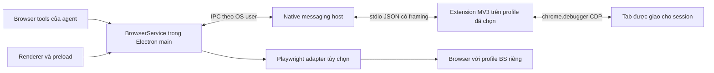

# Đề xuất kết nối browser cho BS Coding v1.3.8

**Ngày:** 2026-10-01. **Trạng thái:** đề xuất đã được duyệt và triển khai Native Messaging trong v1.3.8; nội dung bên dưới giữ lại lý do thiết kế. Hiện trạng và giới hạn được cập nhật tại docs/design/08-browser.md. Managed Playwright mode và Chrome Web Store publication chưa triển khai.

## Khuyến nghị

Dùng **Chrome extension MV3 trên profile thật của người dùng + Native Messaging** làm kết nối chính. Extension tiếp tục điều khiển tab bằng `chrome.debugger`/CDP; thay transport WebSocket localhost bằng native host nhỏ, nối tới main process qua IPC riêng của hệ điều hành.

Giữ browser do Playwright quản lý, với profile riêng, như một chế độ tùy chọn cho kiểm thử hoặc công việc cần môi trường tách biệt. Hai chế độ phải được đặt tên rõ ràng và được người dùng chọn. Profile thật giữ nguyên phiên đăng nhập sẵn có; profile do BS quản lý cần người dùng đăng nhập riêng.

Native Messaging giải quyết vận chuyển, nhận diện extension và vòng đời kết nối. Muốn thao tác đáng tin cậy với nhiều agent còn phải sửa quyền sở hữu tab, snapshot và thứ tự thực thi lệnh. Thay transport riêng lẻ không đủ để đạt mục tiêu này.

## 1. Cơ chế hiện tại và điểm yếu có bằng chứng

Đối chiếu trực tiếp source hiện tại, `AGENTS.md`, `docs/design/00-goals.md` và các bài kiểm thử. Các spec browser tháng 8 là lịch sử quyết định; mục tiêu dùng profile thật cũng khớp source hiện tại. `docs/design/` hiện chưa có tài liệu miền mô tả đầy đủ browser.

| Hiện trạng | Bằng chứng | Hệ quả cần xử lý |
|---|---|---|
| Main mở HTTP/WS trên `127.0.0.1:3927`; extension dùng port lưu hoặc dò đúng port này | `src/main/browser/bridge.ts`, dòng 28–108; `src/browser-extension/background.ts`, dòng 59–73 | Xung đột port làm startup thất bại. Đổi port cần cơ chế discovery thật; hiện không có fallback port tự động. |
| Pair bằng mã 6 chữ số, TTL 5 phút; mỗi lần `start()` sinh mã mới | `src/main/browser/bridge.ts`, dòng 60–72, 213–225 | Extension có thể tự pair lại trong cùng app session sau TTL; khởi động lại BS vẫn mất trust. `sessionPaired` không gắn với profile/client cụ thể. |
| Socket mới đóng và thay socket cũ trước khi xác thực | `src/main/browser/bridge.ts`, dòng 184–209 | Hai Chrome profile tranh một socket. Kết nối chưa pair có thể làm ngắt kết nối đang hoạt động. |
| Dispatcher nhận `result` và `event` mà không kiểm tra socket đã xác thực; upgrade không kiểm tra Origin | `src/main/browser/bridge.ts`, dòng 108, 189–201, 228–248, 286–294 | Localhost không tự tạo ranh giới tin cậy. Event chưa xác thực có thể trộn vào log; kết quả cần ràng buộc với đúng connection/session. |
| Worker đã có heartbeat 20 giây, alarm 30 giây và reconnect tăng dần tới 30 giây | `src/browser-extension/background.ts`, dòng 8–9, 151–157, 545–555 | Đã có biện pháp chống MV3 idle; không nên kết luận lỗi chỉ do thiếu keepalive. Chưa có kiểm tra pong quá hạn, handshake phiên bản hoặc lifecycle thống nhất. |
| Một `workingTabId` và một snapshot dùng chung toàn extension; ref bắt đầu lại từ `r1` | `src/browser-extension/background.ts`, dòng 26–35, 202–214, 306–310, 453; `src/browser-extension/ax-snapshot.ts`, dòng 156–170 | Agent/session có thể ghi đè tab hoặc snapshot của nhau. Ref cũ có thể trỏ tới phần tử trong snapshot mới cùng tab. Khi mất tab làm việc, fallback về tab active có thể tác động tab người dùng. |
| Chỉ việc attach/detach debugger được tuần tự hóa; các command được chạy bất đồng bộ | `src/browser-extension/debug-session.ts`, dòng 37–70; `src/browser-extension/background.ts`, dòng 129–131, 328–496 | Lệnh đang đọc tab A có thể bị lệnh khác chuyển debugger sang tab B. Cần khóa toàn thao tác hoặc attachment riêng theo tab. |
| Script trên mọi trang intercept `console`, `fetch` và XHR; manifest không khai báo execution world | `src/browser-extension/content.ts`, dòng 131–183; `src/browser-extension/manifest.json` | Content script mặc định chạy trong isolated world; intercept không đảm bảo quan sát được console/network của JavaScript trang. Thu thập rộng còn tăng phạm vi dữ liệu riêng tư. |
| Launcher mở Chrome bằng một số đường dẫn cố định, không chọn profile; app copy extension build mỗi lần chạy | `src/main/browser/chrome-launcher.ts`, dòng 21–36, 52–58; `src/main/browser/chrome-path.ts` | Chưa bảo đảm đúng profile. Copy file không đồng nghĩa Chrome đã reload extension đang chạy; app và extension có thể lệch phiên bản. |
| Test bridge dùng WS client giả; debugger dùng mock | `tests/integration/browser/bridge-flow.test.ts`; `tests/unit/browser/bridge.test.ts`; `tests/unit/browser/debug-session.test.ts` | Chứng minh router/pairing hoạt động với giả lập; chưa chứng minh Chrome thật qua idle, restart, update, DevTools hoặc nhiều profile. |

Ngoài ra, tool description hiện nói mặc định tab active/visible, trong khi implementation ưu tiên working tab. Protocol trong `src/shared/browser-types.ts` chưa có version, client identity, browser epoch, owner session hoặc snapshot ID.

## 2. So sánh ba hướng

| Hướng | Điểm mạnh | Chi phí và giới hạn | Phù hợp |
|---|---|---|---|
| **Playwright quản lý browser + persistent profile riêng** | App kiểm soát process, lifecycle và browser version; có locator/actionability/wait chuẩn; thuận lợi cho kiểm thử | Login lại trên profile riêng; tải/đóng gói browser hoặc quản lý browser channel; app chịu trách nhiệm process và profile lock | Browser cho kiểm thử, localhost, môi trường tách biệt |
| **Extension + Native Messaging + `chrome.debugger`** | Dùng profile thật đang đăng nhập, không cần restart Chrome với debug flags; không phụ thuộc port TCP; Chrome nhận diện native host và extension allowlist; `connectNative` hỗ trợ vòng đời MV3 | Phải đóng gói native helper và đăng ký host theo OS; cần extension ID ổn định; vẫn chịu debugger detach, policy và thay đổi CDP | **Kết nối chính cho BS Coding** |
| **Extension + WS được gia cố** | Ít thay đổi triển khai; tiện cho bản portable/dev; giữ profile thật | Phải tự làm discovery, Origin/auth, trust persistence, rate limit, heartbeat deadline và MV3 reconnect; vẫn có endpoint localhost | Transport chuyển tiếp trong migration, hoặc chế độ dev được bật rõ ràng |

### Giới hạn quan trọng của phương án CDP trực tiếp

Từ **Chrome 136**, `--remote-debugging-port` và `--remote-debugging-pipe` không được tôn trọng khi debug thư mục dữ liệu Chrome mặc định; cần `--user-data-dir` trỏ tới thư mục khác. Playwright cũng ghi rõ không hỗ trợ tự động hóa profile Chrome mặc định. Vì vậy, đề xuất “mở port CDP để dùng ngay Chrome đang đăng nhập” không phải đường thay thế đáng tin cậy cho yêu cầu profile thật.

`connectOverCDP()` chỉ hỗ trợ Chromium và có độ tương thích thấp hơn kết nối protocol riêng của Playwright. Nếu app trực tiếp launch browser phục vụ automation, ưu tiên Playwright persistent context cùng browser build đã kiểm thử. Không clone profile đang chạy hoặc sao chép cookie/token để chuyển người dùng sang profile mới.

Native Messaging và `chrome.debugger` là hai lớp khác nhau: Native Messaging chuyển lệnh giữa app và extension; debugger thực thi lệnh trên tab. Không mặc định coi chúng là một endpoint CDP đầy đủ mà `connectOverCDP()` có thể dùng trực tiếp.

## 3. Kiến trúc được đề xuất

### Main process: BrowserService

- Sở hữu registry kết nối, trạng thái, trust/revoke, session binding, tab lease, queue và deadline. Mỗi profile/extension instance có kết nối riêng; không còn một socket toàn cục.
- Tách `BrowserTransport` khỏi `BrowserAutomationAdapter`. Primary transport là Native Messaging; WS chỉ là adapter chuyển tiếp được chọn rõ ràng. Automation adapter cho profile thật là extension CDP; managed browser có adapter Playwright riêng.
- Tool của native Bs agent và adapter MCP/CLI nếu được bổ sung đều đi qua cùng service và permission policy. Không để mỗi agent tự mở transport hoặc chiếm browser.
- Renderer nhận trạng thái an toàn qua IPC contract tập trung. Native host, credential trust, đường dẫn profile quản lý và browser process thuộc main; `src/shared` chỉ chứa types/protocol thuần.

### Native host nhỏ

Chrome tạo **process riêng** cho `runtime.connectNative()`. Không thể xem kết nối này là stdin của Electron đang chạy. Đóng gói helper riêng làm cầu nối tới BrowserService bằng Windows named pipe hoặc Unix domain socket.

Helper chỉ làm framing, handshake, proxy và liveness. Không có shell tool, không đọc profile/cookie, không nhận lệnh tùy ý để chạy process. STDOUT chỉ chứa protocol; diagnostics ghi STDERR. Nếu BS chưa chạy, báo “BS Coding chưa chạy”; mở app bằng hành động người dùng riêng, tránh khởi chạy một agent ngầm.

IPC helper ↔ app được giới hạn theo OS user, kiểm tra peer phù hợp nền tảng và dùng handshake ràng buộc app instance. Manifest allowlist giới hạn extension ID; helper xác minh caller origin. Các biện pháp này bảo vệ khỏi website/extension khác trong mô hình tin cậy đã chọn, không bảo vệ khỏi malware có toàn quyền trên cùng tài khoản OS.

### Extension và quyền sở hữu browser

- Mỗi profile sinh một client ID riêng lưu trong `chrome.storage.local`; người dùng đặt nhãn như “Chrome Work”. Client ID là định danh, không tự đủ để xác thực. Trust được thiết lập qua native host và enrollment được app ghi nhận; có revoke và đổi trust credential.
- Extension không có API chung để cung cấp đường dẫn/tên profile Chrome chính xác. UI dùng nhãn người dùng, browser kind, connection ID và danh sách tab; không đoán profile bằng filesystem hoặc thứ tự cửa sổ.
- Session chọn đúng connection rồi tạo tab riêng hoặc nhận tab người dùng đã giao. Tab ID luôn đi kèm connection/browser epoch và owner session. Không fallback sang tab active khi tab đã giao biến mất.
- Tab group “Bs” hỗ trợ nhìn thấy tab; quyền điều khiển dựa vào lease, không dựa vào tên group. Hai session có thể song song trên tab riêng; cùng tab cần một writer tại một thời điểm.
- Sau browser restart, tab ID và epoch phải được đối chiếu lại. Nếu không có ánh xạ duy nhất có thể chứng minh, báo cần chọn lại tab; không tự chọn theo URL/title khi có nhiều tab trùng nhau.

## 4. Protocol và thực thi thao tác

Handshake gồm `protocolVersion`, `extensionVersion`, `hostVersion`, `appVersion`, `clientId`, browser epoch và capabilities. Phân biệt phiên bản sản phẩm với phiên bản protocol. Major không tương thích trả hướng dẫn cập nhật; minor chỉ dùng capability đã thương lượng. Extension và app có thể update ở thời điểm khác nhau.

Command envelope cần ít nhất: request ID, connection epoch, owner/session ID, tab handle, command, params, deadline và snapshot ID khi dùng ref. Validate runtime ở hai đầu, giới hạn payload/queue và chỉ chấp nhận command allowlist.

- Khóa **toàn command** trên tab, kể cả attach/read/action/result. Nếu giữ một debugger attachment thì serialize toàn adapter; nếu dùng nhiều attachment thì quản lý từng tab và child target rõ ràng.
- Snapshot thuộc session + tab + document generation + snapshot ID. Navigation, tab close, detach và snapshot mới phải làm ref cũ hết hiệu lực. Ref của session khác không được tái sử dụng.
- Network/console chuyển sang sự kiện CDP trên tab được giao; chỉ bật domain khi cần. OOPIF cần child target/session handling theo khả năng Chrome; không im lặng trả snapshot “đầy đủ” khi một frame không đọc được.
- Dùng thao tác CDP/locator có điều kiện element còn tồn tại, đúng frame và actionable; có wait với deadline. Đổi transport không làm `element.click()` tự trở thành tương tác input đáng tin cậy.
- Disconnect giải quyết pending request ngay với trạng thái phân biệt “chưa gửi” và “đã gửi, chưa biết kết quả”. Có thể retry read/liveness theo policy; không tự replay click/type/submit vì có thể gây gửi hai lần.
- Đưa lỗi có mã như `HOST_NOT_INSTALLED`, `APP_OFFLINE`, `VERSION_MISMATCH`, `TAB_CLOSED`, `STALE_SNAPSHOT`, `DEBUGGER_DETACHED`, `POLICY_BLOCKED`, `RESULT_UNKNOWN` vào service. Tool message hướng người dùng tới hành động khôi phục phù hợp.

Native Messaging dùng JSON UTF-8 với prefix độ dài 32 bit theo native byte order. Chrome giới hạn host → extension **1 MB**, extension → host **64 MiB**. Thiết kế payload nhỏ ở cả hai chiều; chunk artifact lớn có sequence, quota và kiểm tra toàn vẹn. Screenshot/snapshot lưu local như hiện tại, không đưa blob không giới hạn vào transcript.

## 5. Cài đặt, reconnect và trải nghiệm người dùng

### Bản phát hành

1. Installer BS cài helper và đăng ký native host ở phạm vi user. Không yêu cầu admin chỉ để đăng ký user host.
2. Người dùng mở profile mong muốn, cài extension từ Chrome Web Store, bấm kết nối BS Coding và chọn/đặt nhãn profile một lần. UI phải nói rõ quyền debugger và phạm vi tab; không hứa cài extension âm thầm.
3. BS hiển thị browser đã kết nối và tab được giao. Những lần sau tự khôi phục trust/kết nối; không nhập port hay mã mới mỗi lần mở app.

Chrome Web Store cho extension ID ổn định và cơ chế update. Trong giai đoạn dev/portable có thể load unpacked với public key để giữ ID và nút đăng ký/kiểm tra helper rõ ràng. Helper phải có path ổn định hoặc được sửa registration sau update/move. Copy source unpacked chỉ phục vụ dev; cần hiển thị extension version thực sự đang chạy và hướng dẫn reload khi lệch.

### Native host theo nền tảng

| Nền tảng | Đăng ký và vận hành đề xuất |
|---|---|
| Windows | HKCU `Software\Google\Chrome\NativeMessagingHosts\<host-name>` trỏ tới manifest có absolute helper path và exact `allowed_origins`. Kiểm tra registry view 32/64 bit; named pipe có ACL cho user. Installer/update/uninstaller sửa đúng registration do BS sở hữu. |
| macOS | Manifest user-level trong Chrome `NativeMessagingHosts` theo đường dẫn chính thức; binary có quyền execute, signing/notarization cùng release. IPC Unix socket giới hạn user; giữ helper path hợp lệ sau app update. |
| Linux | Manifest user-level trong Chrome/Chromium `NativeMessagingHosts` đúng browser; binary executable và Unix socket giới hạn user. Không giả định mọi gói sandbox Snap/Flatpak đều chạy được host ngoài sandbox: kiểm tra trước, báo rõ giới hạn hỗ trợ. |

Edge/Chromium cần adapter đăng ký manifest và kiểm thử theo browser riêng; không suy diễn đã hỗ trợ chỉ vì cùng engine. Chrome là target đầu tiên. Incognito không kết nối mặc định; nếu sau này hỗ trợ phải có consent và session boundary riêng.

### Vòng đời

State machine đề xuất: `notInstalled → connecting → authenticating → ready`; lỗi có `reconnecting`, `appOffline`, `browserOffline`, `incompatible`, `revoked`, `error` với reason cụ thể.

- Worker đăng ký listener ở top level; khởi tạo lại từ storage sau wake. `connectNative()` giữ worker hoạt động trong khi port sống; host crash phải được xử lý bằng `onDisconnect` và reconnect có backoff/jitter. Alarm là wake fallback, không được gọi là bảo đảm kết nối tức thì sau mọi sleep.
- Host và app restart có epoch mới. Reconnect xác thực lại và thương lượng capabilities; trust được giữ nhưng pending mutation không tự chạy lại.
- Sau OS sleep, extension reload hoặc browser update, reconcile connection, debugger attachment, tab lease và snapshot trước khi nhận lệnh mới.
- App kết nối không đồng nghĩa tab có thể thao tác. Chrome DevTools có thể làm debugger detach; enterprise policy có thể cấm debugger/host access/screenshot. Hiển thị lỗi đúng nguyên nhân, không reattach liên tục khi người dùng đang mở DevTools.
- Heartbeat/liveness đo được ở từng chặng, với deadline và trạng thái chờ. Khi app đóng thật, dừng queue và detach tab; nếu minimize-to-tray vẫn là app đang chạy thì giữ lifecycle tương ứng.

### Phiên bản Chrome

Tài liệu Chrome ghi: Native Messaging giữ MV3 worker từ Chrome 105; traffic WS giữ worker từ 116; debugger session từ 118; alarm chu kỳ 30 giây từ 120; debugger flat child sessions từ 125. Source build hiện target Chrome 120 nhưng manifest thiếu `minimum_chrome_version`.

Đề xuất nếu hỗ trợ OOPIF bằng flat sessions ngay từ đầu thì đặt baseline tối thiểu Chrome 125 và kiểm tra capability; release thường xuyên xác nhận trên Chrome stable hiện hành. Không coi protocol attach `'1.3'` là chứng nhận mọi CDP method hoặc policy đều khả dụng.

## 6. Bảo mật và dữ liệu riêng tư

- Primary transport không mở HTTP/WS/CDP TCP listener. Named pipe/Unix socket dùng per-user ACL và handshake; không chấp nhận traffic từ renderer hoặc website như command đã tin cậy.
- Trust có enrollment/revoke rõ ràng; secret cho trust lưu bằng cơ chế bảo vệ của OS ở main. Client credential nếu lưu extension phải tách khỏi page context và không log. Không lấy cookie, password, OTP hoặc Chrome profile directory để pairing.
- Agent chỉ thấy tab/metadata được cấp. List mọi tab của profile để người dùng chọn có thể diễn ra trong picker; tool agent mặc định chỉ liệt kê phạm vi được giao. Console/network chỉ thu khi bật trên tab đó, redact header/token và query nhạy cảm khi ghi log.
- Thay `<all_urls>` content-script tự chạy bằng injection theo tab được giao hoặc permission theo nhu cầu. Debugger là quyền rộng, không thể mô tả như chỉ đọc DOM; cần trình bày thật trong onboarding và kiểm soát ở BrowserService.
- Tool permission tiếp tục qua agent permission system. Tab đã giao vẫn cần tuân theo yêu cầu người dùng về các thao tác gửi/xóa/thay đổi dữ liệu. Không tạo một đường CDP/evaluate tự do để vượt policy.
- Screenshot/snapshot/log ở local có retention, nút xóa và đường dẫn artifact theo session. Giới hạn kích thước, không âm thầm upload hoặc gửi toàn profile tới model.
- Nếu còn WS trong migration: exact extension-Origin allowlist, cryptographic persistent trust, pairing rate limit, authenticated dispatcher, schema/payload limit, heartbeat deadline, connection epoch, và không cho socket chưa xác thực thay socket hiện tại. `/api/status` không trả secret; không dùng CORS `*` khi chỉ cần extension.

## 7. Migration đề xuất

**Giai đoạn 1 — Contract và ownership.** Định nghĩa BrowserService/adapter, lifecycle và protocol version; session/tab/snapshot handles; structured errors; queue và semantics disconnect. Giữ tool names có thể tương thích qua adapter, nhưng bỏ implicit active-tab mutation. Cập nhật tài liệu miền browser khi implementation thực sự thay đổi.

**Giai đoạn 2 — Native transport và installer.** Làm helper, registrations theo OS, stable extension ID, connect/reconnect, trust registry và chẩn đoán. Cho WS hiện tại hoạt động ở chế độ chuyển tiếp được chọn rõ ràng; không auto downgrade sau lỗi native auth hoặc version mismatch.

**Giai đoạn 3 — Automation và Chrome thật.** Quản lý debugger trên tab, snapshot generations, OOPIF và CDP console/network; hoàn tất UX chọn profile/tab và tự khôi phục kết nối. Chứng minh lifecycle thật trước khi đặt Native Messaging làm mặc định.

**Giai đoạn 4 — Phát hành và thu hẹp fallback.** Phân phối extension, kiểm tra update app/extension/helper lệch nhịp, chuyển người dùng WS bằng onboarding ngắn. Dừng listener cũ khi người dùng dùng native mode; giữ đường quay lại phiên bản trước có chủ đích trong rollout. Profile Playwright tùy chọn có thể bổ sung sau, không cần chờ để ổn định profile thật.

## 8. Bằng chứng cần có khi triển khai

Các mục dưới là tiêu chí đề xuất, chưa phải test đã chạy trong lần khảo sát này.

- Unit/integration: validation/version handshake; trust/revoke; sai connection/session/ref; tab lease; concurrent command; payload framing/chunking; pending request khi detach/disconnect; mutation không replay.
- Chrome thật với extension và helper: mở BS trước/sau Chrome, idle dài, restart app/Chrome/worker/helper, sleep/resume OS, extension reload/update, app update, hai profile, nhiều cửa sổ, nhiều agent và tab bị đóng/chuyển/reload.
- Trang kiểm thử xác định: SPA rerender/navigation, popup/tab mới, cross-origin iframe/OOPIF, shadow DOM, console/network thật và screenshot lớn. Xác nhận DevTools/enterprise policy trả lỗi rõ ràng.
- Acceptance: giữ phiên login sẵn có; không restart browser/profile thật; không thao tác nhầm tab; không duplicate mutation; không yêu cầu pair lại qua app restart bình thường; no indefinite pending command; không còn port TCP trong native mode.
- Thu thập thời gian reconnect và failure rate qua nhiều chu kỳ thật; ghi browser/app/extension/helper versions trong evidence. Đặt SLO sau baseline đo được, không tuyên bố ổn định chỉ từ mock tests.
- Khi implementation bắt đầu: theo branch governance `develop/v1`, typecheck, tests phù hợp và packaging kiểm tra helper/manifest trên mỗi OS được tuyên bố hỗ trợ.

## 9. Các quyết định sản phẩm còn cần chốt

1. Phân phối extension chính thức qua Chrome Web Store; trong thời gian chờ store review, định nghĩa rõ cách dùng unpacked/portable.
2. Phạm vi đợt đầu: Chrome trên Windows, hay đồng thời macOS/Linux; Edge là browser riêng trong support matrix.
3. Chính sách giao tab: mặc định tạo tab riêng cho session, và picker để người dùng giao tab đã đăng nhập. Managed Playwright mode có thể để đợt sau.
4. Phạm vi retention của screenshot/snapshot/log và SLO reconnect sau khi có baseline thử nghiệm.

Các quyết định này không làm thay đổi khuyến nghị chính: Native Messaging + extension CDP phục vụ profile thật; service sở hữu session/tab và lifecycle; Playwright quản lý profile riêng là chế độ bổ sung.

## Nguồn chính thức

Đã đọc nguồn qua Firecrawl ngày 2026-10-01; dùng chúng để kiểm tra giới hạn kiến trúc, không thay thế bằng chứng chạy browser thật.

- [Chrome: thay đổi remote debugging từ Chrome 136](https://developer.chrome.com/blog/remote-debugging-port).
- [Chrome: Native Messaging, host registration, allowed origins và payload limits](https://developer.chrome.com/docs/extensions/develop/concepts/native-messaging).
- [Chrome: vòng đời extension service worker và thay đổi theo phiên bản](https://developer.chrome.com/docs/extensions/develop/concepts/service-workers/lifecycle).
- [Chrome: debugger API, child sessions, restricted domains và detach khi mở DevTools](https://developer.chrome.com/docs/extensions/reference/api/debugger).
- [Playwright: connectOverCDP và độ tương thích thấp hơn protocol Playwright](https://playwright.dev/docs/api/class-browsertype#browser-type-connect-over-cdp).
- [Playwright: persistent context, profile lock và giới hạn profile Chrome mặc định](https://playwright.dev/docs/api/class-browsertype#browser-type-launch-persistent-context).
